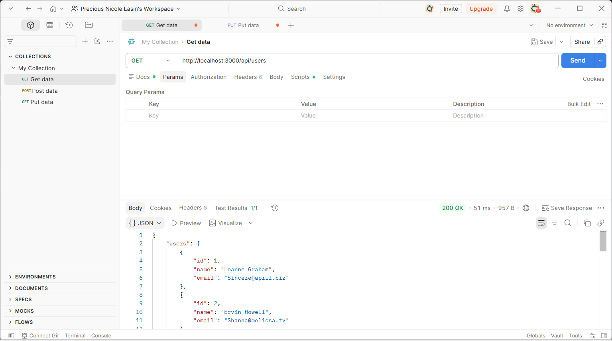
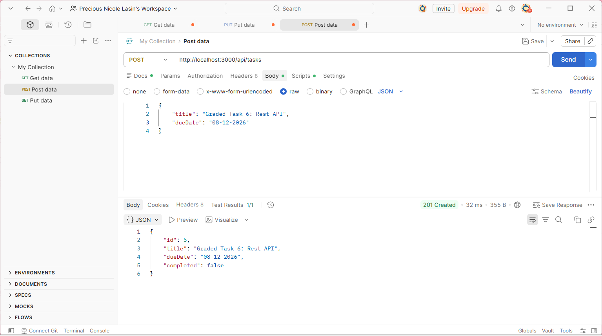
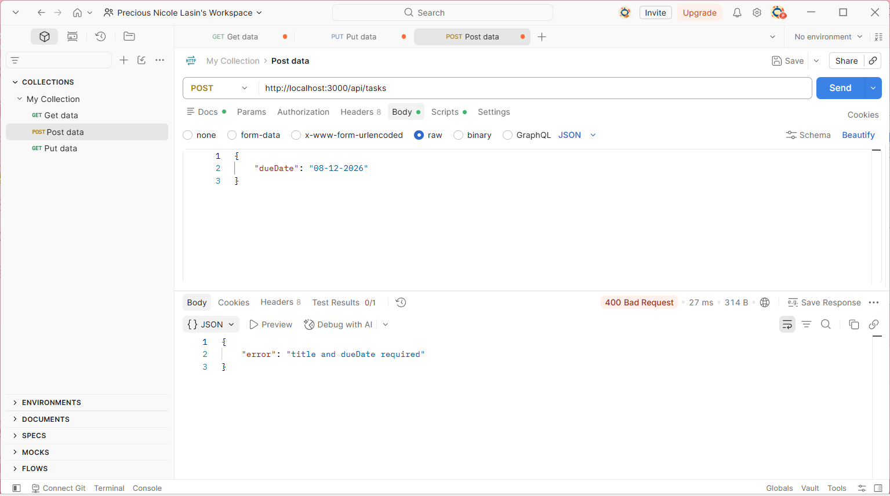
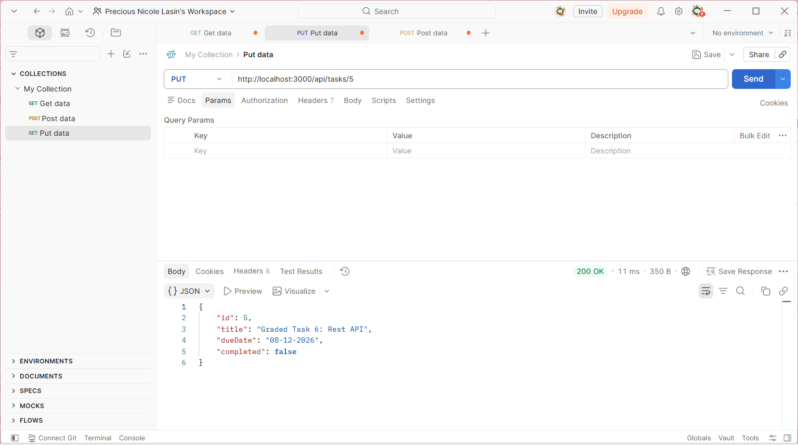
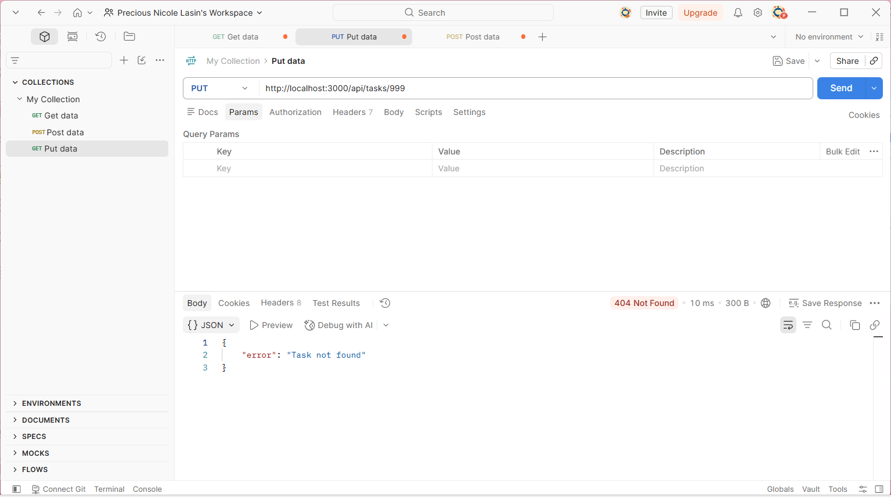
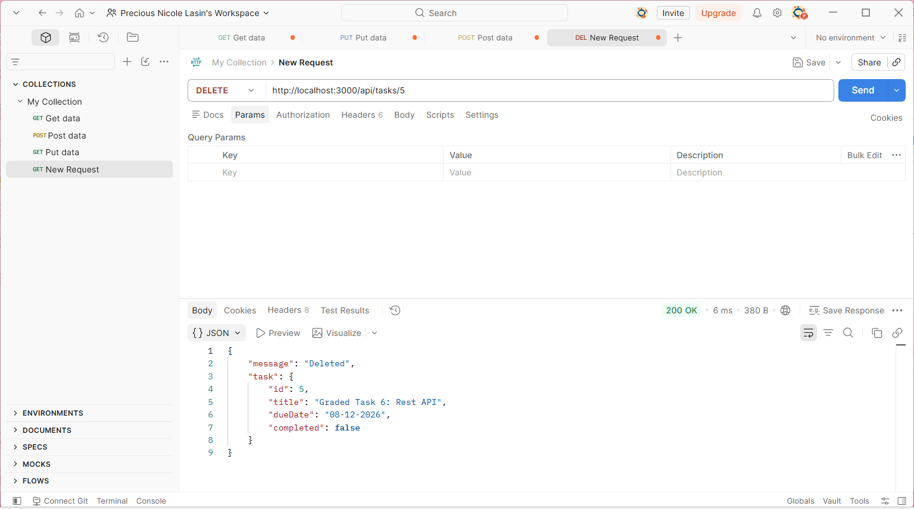
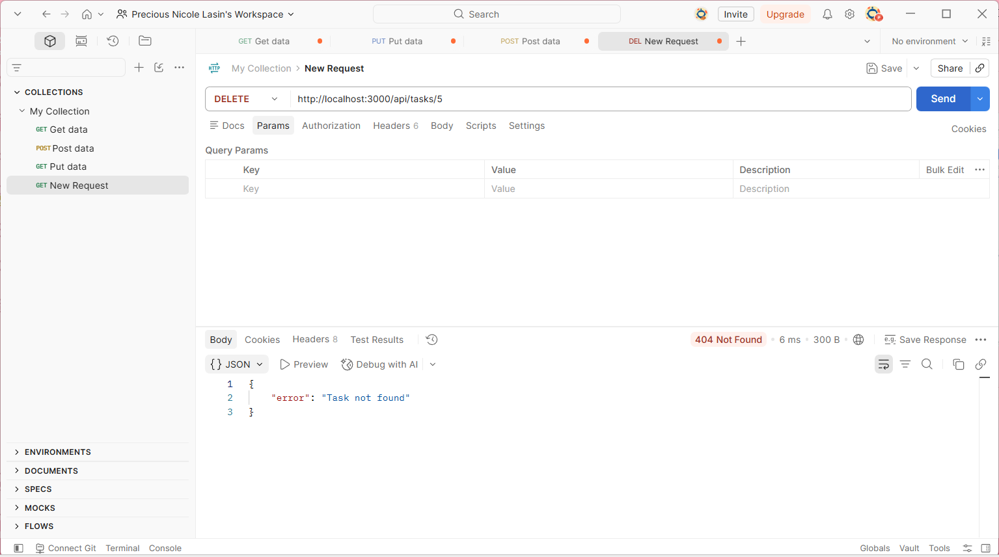

# **itelect2-project**
My IT Elective 2 backend web development project.

**GT1:** Git Foundations 
**GT2:** Branching NodeJS 
**GT3:** AdvanceJS ES6 v3 
**GT4:** AsyncJS Error Handling 
**GT5:** Node Express 
**GT6:** Rest API

## **API Testing**
Graded Task 6: Rest API (Testing)

---

### **GET**
---

Get users

---

### **POST**
---

Post task

Post task return error 400 when post with missing title.

---

### **PUT**
---

Put with an existing id returns 200.

Put with id 999 returns 404.

---

### **DELETE**
---

Delete with an existing id returns 200.

Delete on the same id returns 404.